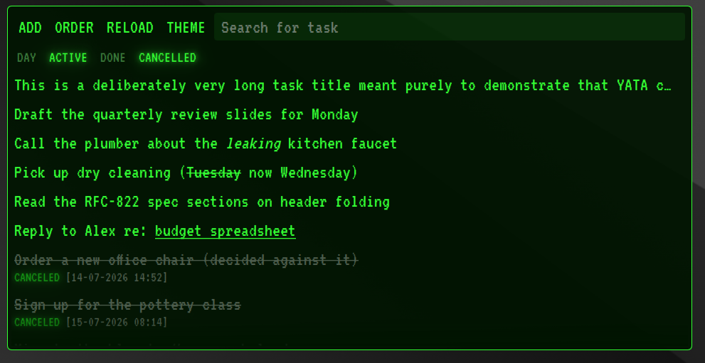
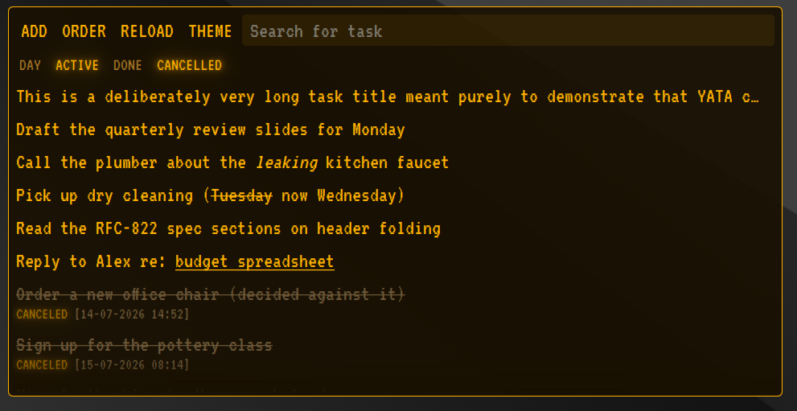
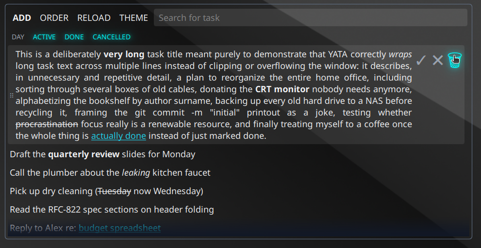
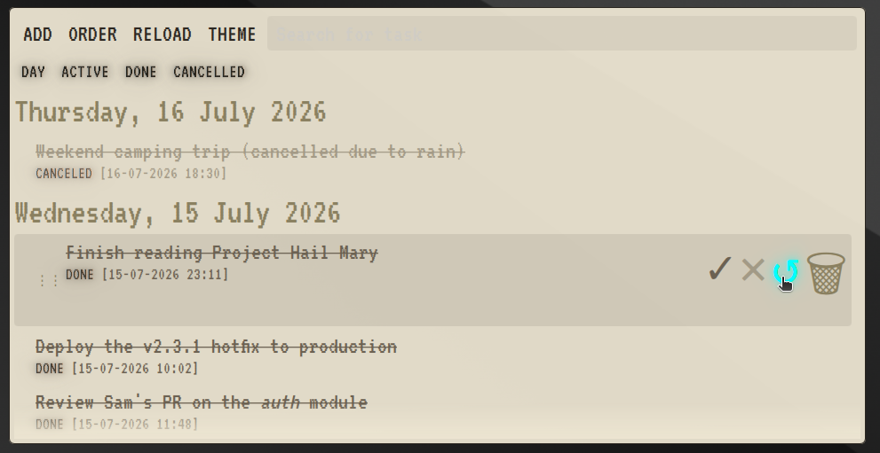
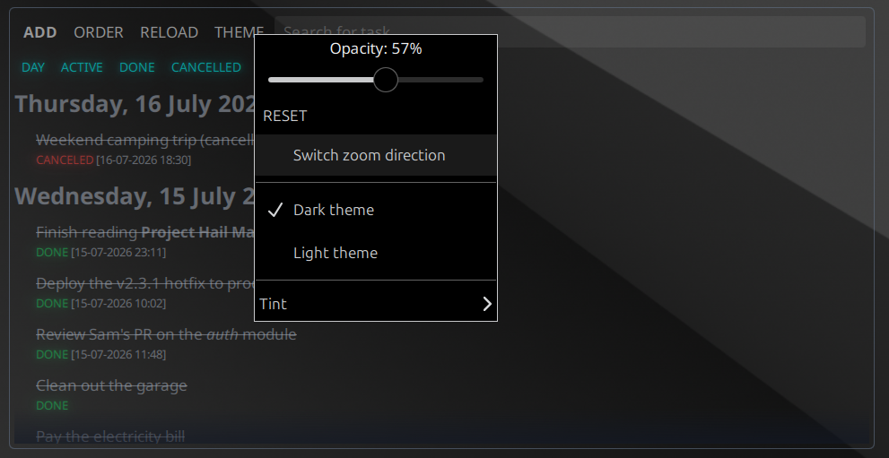
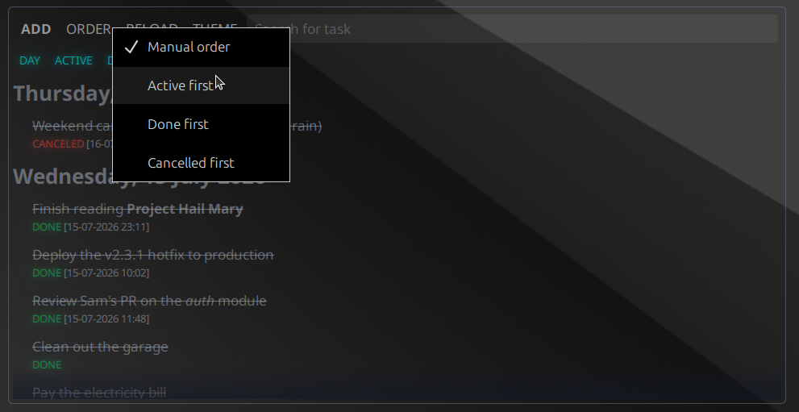

# YATA - Yet Another Todo Application

[](LICENSE)

<table>
  <tr>
    <td></td>
    <td></td>
  </tr>
  <tr>
    <td></td>
    <td></td>
  </tr>
  <tr>
    <td></td>
    <td></td>
  </tr>
</table>

A minimal always-on-desktop todo list for GNOME/Ubuntu: a borderless,
transparent, vertical list of one-line tasks that sits on the desktop like a
sticky note.

See `claude-docs/instructions.md` for the full specification.

## Features

- Add, edit, cancel, mark done, re-open and delete tasks
- Task text supports Markdown (bold, italic, ...)
- Drag and drop to reorder tasks (grip icon on hover)
- Group the list by day (with a bigger day-heading font and indented tasks),
  or sort with a chosen status first — status sort also applies within each
  day when both are active
- Non-active tasks show a small check (done) or cross (cancelled) icon in
  front of their text, colored green/red in the plain theme or tint-native
  colors under a CRT tint
- Realtime text search
- Drag and drop to reorder tasks (grip icon on hover) — works in day-grouped
  view too, and dragging a task onto a different day's section reassigns it
  to that day
- Window position/size is remembered per monitor layout; first launch
  centers the window at 20% of the screen width with a 9:16 aspect ratio
- Theming via the "Theme" button (toolbar) or the right-click background
  menu: an opacity setting (5-100%, click the progress bar to type an exact
  value), a RESET button (restores default opacity and font size), Dark
  theme/Light theme (the safe/plain look — Noto Sans font, picking either
  also switches to it), and a Tint submenu with four looks that each
  recreate a specific old CRT/terminal display — green phosphor, amber
  phosphor, paperwhite monitor, and teletype paper — with a monospace font
  and tint-appropriate colors for active/done/cancelled tasks, borders,
  buttons and fields (tints ignore the Dark/Light choice, but do follow the
  opacity and font-size settings). Window opacity is a single global
  setting applied to every theme alike
- `Ctrl+=`/`Ctrl+-` grow/shrink the whole app's font size; `Ctrl+0` resets it
- Toolbar button captions render in capitals (ADD, DAY, STATUS, RELOAD,
  THEME) in every theme; RELOAD re-reads `tasks.json` from disk, for
  picking up changes made by an external process

## Usage notes

- The window has no title bar; drag it by pressing on empty toolbar space
- Use the toolbar's "Theme" button, or right-click the background, for
  theme options; the background menu also has Quit
- Double-click a task to edit its text
- Right-click a task for the option to delete it permanently

## Quick start

```sh
./run.sh
```

See `BUILD.md` for setup and test instructions, including `./build.sh` to
package YATA into a single standalone `dist/yata-X.Y.Z` executable.

## AI-assisted development

This project was built with [Claude Sonnet 4.6](https://www.anthropic.com/claude) (`claude-sonnet-4-6`) by Anthropic as an active development collaborator — writing code, reviewing architecture decisions, and implementing features end-to-end alongside the human author.

## Third-party notices

**VT323** font by Peter Hull — used for the CRT tint themes.  
Copyright 2011 The VT323 Project Authors (peter.hull@oikoi.com).  
Licensed under the [SIL Open Font License 1.1](resources/OFL-VT323.txt).

## Known limitation

On X11, the window stays below other app windows (and above the desktop
icons layer) via a direct `_NET_WM_STATE_BELOW` EWMH request
(`yata-src/x11_stacking.py`), not Qt's `Qt.WindowStaysOnBottomHint` — that
hint maps to `_NET_WM_WINDOW_TYPE_DESKTOP` on GNOME/Mutter, which places the
window below the desktop background layer itself (invisible), rather than
merely beneath other app windows.

On **Wayland** (GNOME's default session), there is no equivalent for
ordinary applications — Wayland compositors don't let regular toolkit
windows request a stacking layer at all, so on Wayland the app behaves like
a normal window instead (visible and usable, but not pinned beneath
others). Revisit if a GNOME-Wayland-compatible way to achieve the intended
layering is found.
