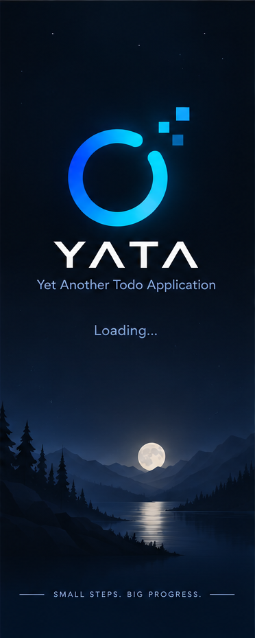
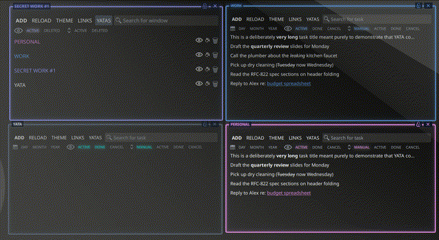

# YATA - Yet Another Todo Application

[](LICENSE)

<p align="center">
  
  
</p>

Mini "sub-window" manager. Which allows to draw content of its plugins into
separate windows. Windows sticks to desktop (like sticky note). Content
of the windows is wrote by the user. There are several "internal" plugins,
TODO application being one of them.

Besides my desire to have simple TODO application, the UI/UX feeling was inspired
by [Awesome WM](https://awesomewm.org/) and [conky](https://github.com/brndnmtthws/conky).

## Features

- **Multiple independent sticky sub-windows**, each pinned to the desktop
  and running one plugin (TODO list, work timesheet, ...) — add, rename,
  hide/show or delete windows via the YATAS view, each with its own
  settings and an optional custom border/glow color
- Drag a task (or other draggable plugin content) from one window onto
  another to move it there
- **Theming** shared by every plugin: Dark/Light look, or one of four
  CRT/terminal tints (green phosphor, amber phosphor, paperwhite monitor,
  teletype paper), plus adjustable window opacity and font size
- A lock icon cycles Unlocked → Auto-locked → Locked, to blur/freeze a
  window's content in place
- No title bar — drag a window by empty toolbar space; right-click the
  background for the theme menu and Quit
- `./run.sh --backup` zips every window's settings and data into a
  timestamped archive

## Internal plugins

### TODO list (main motivation behind the YATA)

- Add, edit (double-click), cancel, mark done, re-open and delete tasks;
  task text supports Markdown
- Reorder manually by dragging, or sort by status (Active/Done/Cancel),
  with independent status filters and day/Month/Year grouping (calendar
  views show per-day/month status counts)
- Press-and-hold a task's done/cancel icon to attach an optional Markdown
  note explaining the change
- Realtime text search, plus a LINKS view listing every task that
  contains a Markdown link

### [[IN_PROGRESS]] Work timesheet notebook and exporter

- Tracks named work items, each with its own history of start/stop
  sessions (one running at a time per window) and a per-day
  ON-SITE/REMOTE marker; a session left running when YATA closes is
  marked abandoned
- **Summary** view per day/week/month/year: worked vs. target time,
  remaining/overtime, with public holidays (fetched from the
  OpenHolidays API, cached offline) excluded from the target the same
  way weekends already are
- **PDF export** (day/week/month) with an optional customer/contractor
  header and signature lines

### [[IN_PROGRESS]] System / PC monitor

## Quick start

```sh
./run.sh
```

Runs YATA behind a startup splash (`x-loader/`, a pure-X11 splash — see
`BUILD.md`) that fades out once every window from this launch is actually
shown; use `./run-yata.sh` instead to skip the splash entirely (faster for
development), or `./run-loader.sh` to preview the splash on its own.

See `BUILD.md` for setup and test instructions.

### Backing up your data

```sh
./run.sh --backup   # or -b
```

Instead of starting the app, this zips YATA's whole config and data
directories (every window's settings and tasks) into a timestamped
`yb-<date>-<time>.zip` file in the current directory — e.g.
`yb-2026-08-26-18-23.zip`. If a file with that name already exists (e.g.
you ran `--backup` twice in the same minute), a `-1`, `-2`, ... suffix is
added instead of overwriting it.

## AI-assisted development

This project was built with [Claude](https://www.anthropic.com/claude), Anthropic's AI model, as an active development collaborator — writing code, reviewing architecture decisions, and implementing features end-to-end alongside the human author.

## Third-party notices

**Application icon**, **lock icons** (the glass lock feature's
locked/auto-locked/unlocked states), and the **startup loader's** artwork
(the logo and the light/dark mountain-and-lake background) generated by
ChatGPT (OpenAI), steered/iterated on by the author.

**VT323** font by Peter Hull — used for the CRT tint themes.
Copyright 2011 The VT323 Project Authors (peter.hull@oikoi.com).
Licensed under the [SIL Open Font License 1.1](resources/OFL-VT323.txt).

**Toolbar icons** from [the Noun Project](https://thenounproject.com) (the SVGs
bundled in `resources/assets/` have their in-file attribution text stripped
so they render cleanly at icon size — attribution is given here instead, as
required by the Noun Project's license), licensed under
[Creative Commons Attribution (CC BY)](https://help.thenounproject.com/hc/en-us/articles/200509798-What-licenses-do-you-offer-for-icons):
- "Calendar" by Adrien Coquet — `resources/assets/noun-calendar-999730.svg`
- "Visibility" by Ferdinand Partahi Jaya Tambunan — `resources/assets/noun-visibility-5028261.svg`
- "Arrow Up Down" by Nursila — `resources/assets/noun-arrow-up-down-5553937.svg`
- "Search" by Lyhn — `resources/assets/noun-search-2353120.svg`
- "Link" by Design Queen — `resources/assets/noun-link-7985857.svg`
- "Paint Bucket" by Arthur Shlain — `resources/assets/noun-paint-bucket-104334.svg`
- "Notes" by Suharsono — `resources/assets/noun-notes-8410855.svg`
- "Sleep Mode" by IconPai — `resources/assets/noun_SleepMode_7877974.svg`
- "Start" by Larea — `resources/assets/noun_start_3131880.svg`
- "Stop" by Wahyu Adam — `resources/assets/noun_Stop_8389958.svg`
- "Summary" by I Putu Dicky Adi Pranatha — `resources/assets/noun_summary_8078125.svg`
- "Time List" by Iconiqu — `resources/assets/noun_timelist_4046224.svg`

## Known limitation

On X11, the window stays below other app windows (and above the desktop
icons layer) via a direct `_NET_WM_STATE_BELOW` EWMH request
(`yata-src/x11_stacking.py`), not Qt's `Qt.WindowStaysOnBottomHint` — that
hint maps to `_NET_WM_WINDOW_TYPE_DESKTOP` on GNOME/Mutter, which places the
window below the desktop background layer itself (invisible), rather than
merely beneath other app windows.

On **Wayland** (GNOME's default session), there is no equivalent for
ordinary applications — Wayland compositors don't let regular toolkit
windows request a stacking layer at all, so on Wayland the app behaves like
a normal window instead (visible and usable, but not pinned beneath
others). Revisit if a GNOME-Wayland-compatible way to achieve the intended
layering is found.


